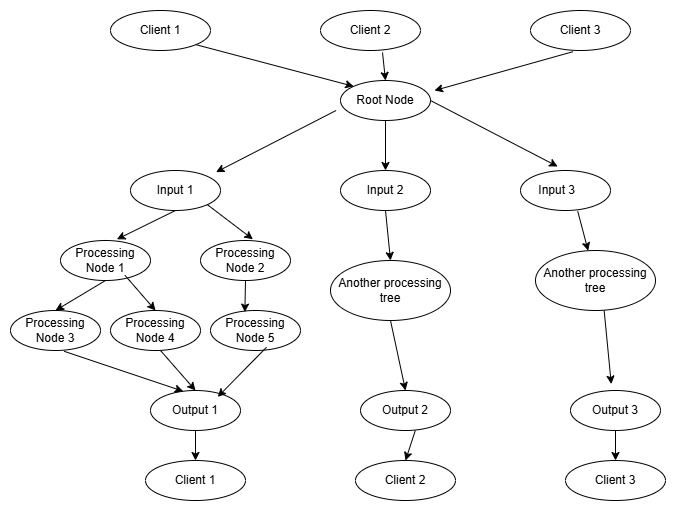
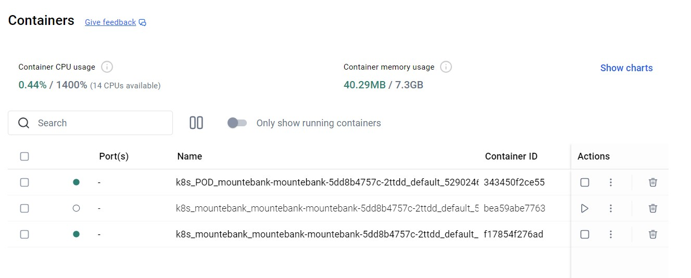
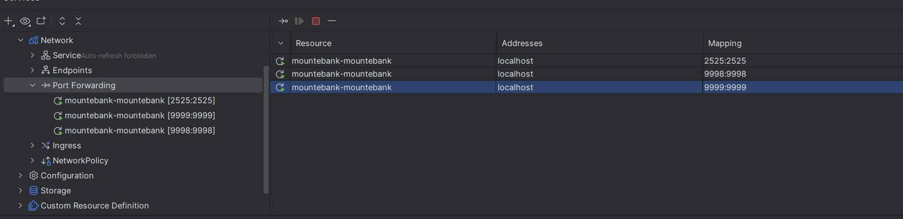
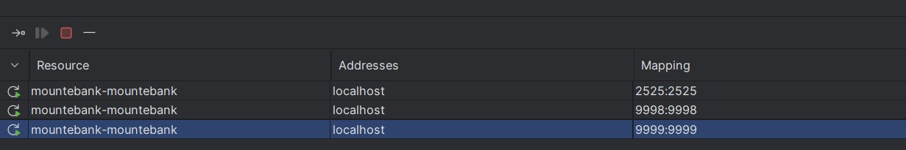
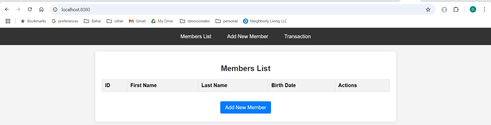
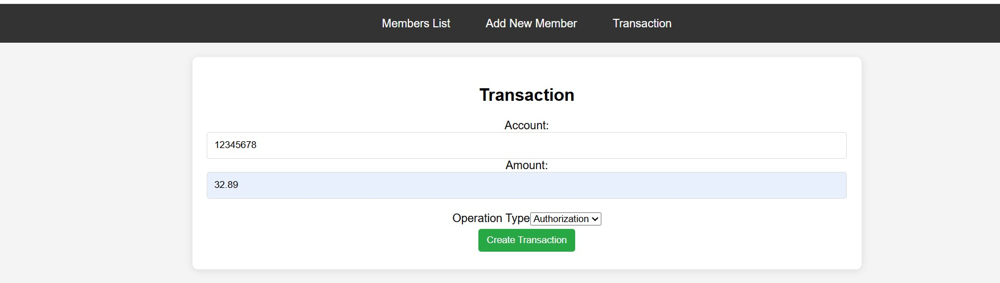
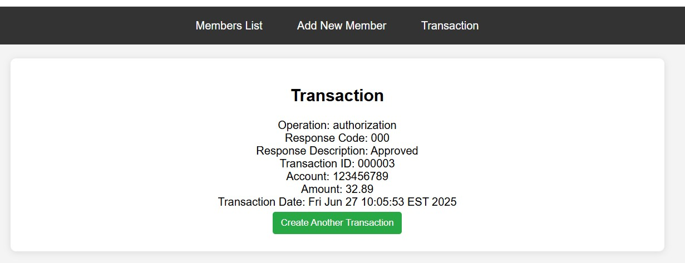

# generic-processor

# Overview
The generic processor will receive an incoming REST request from the client. It converts the
request(Java POJO) to a hierarchical map which is passed on to a tree of processing nodes.
Each processing node runs asynchronously. The chain of execution will follow the path from the
input through the processing tree until the output node is reached which returns the response to
the calling client. When a node has multiple child nodes, it will decide via business logic what is
the next node to be executed. It can only execute one node out of all the child nodes. If a given
processing node is dependent on the results of previous nodes it will wait until the previous
nodes have completed before it begins processing.  
Configuration is done via yaml files. Each yaml represents one client type with a unique input
and output. When the app receives the request, the app will determine which input/output tree
to use and app will traverse the decision trees until it reaches the output.  
The application uses Spring WebClient which is completely reactive and is based on the
publish/subscribe model.  This means that a processing node won't block while waiting
for a response from a backend microservice.  

# Test Use Case

The configuration of usda.yaml is a simple one.  It is basically decision tree that
consists of either an authorization or a purchase.  A vehicle comes into a shop for
repair and the job to work on the vehicle is the authorization(you still don't know what is 
to be done or how much it will cost).  The authorization will be the limit that can be
applied.  After the car is repaired and the actual amount is known, this will be the
purchase and will further the financial request to the bank.  The use case is relatively
simple but in real life many more processing nodes would be involved(i.e. looking up
an account number via a driver ID)

# Testing
Testing is done using WireMock to simulate a backend connection. In the test processing nodes
have a test latency of 300 ms. The single tests ensures that all processing nodes executed
successfully. The performance test created 100 concurrent threads which completed in 4.924
secs giving a pass through of about 20 transactions/sec or 1.75 million transactions daily.

# Metrics
Metrics and Graphs are done with open source libraries
- Prometheus: For storing and querying time-series data.
- Grafana: For graphing of data

# Requirements for Running Locally
- Java(SDK) 21
- npm
- React
- Helm
- Docker Desktop(with Kubernetes enabled)
- Gradle 8.9
- Postman (for building the mountebank imposters)
- git
- Intellij (or equivalent IDE)

# Installation 

1. Download and install the latest DockerDesktop version and enable Kubernetes
2. Download and install Helm
3. Download and install Postman(or equivalent)
4. Download and install gradle
5. Download and install java SDK 21
6. Download and install Intellij(or equivalent)
7. Clone this repo to your projects directory
8. cd to the helm-charts directory.  
9. Run the following command: helm install mountebank ./mountebank-chart

In your Docker Desktop you should see the following

10. In Intellij gradle window run the following gradle tasks  
    gradle clean and then gradle shadowJar.  This will build the application
11. In Intellij install the kubernetes and helm plugins.  This will allow you to 
    config the Kubernetes pods and services
    In Intellij you should see something like this
    
12. In the Kubernetes Intellij Window add port forwarding for ports 2525, 9998 and 9999
    
13. Run the two Postman post requests.  
    BackendRequests and AuthorizeBackendRequests.
    This will create the imposters you need to run the app

13. In the src/main/java directory right click the ProcessorApplication and
    run the application
14. After about 30 seconds enter this address in your browser
    http://localhost:8080/
    You should see this:
    
15. Chose transaction and enter in any account number and amount
    You should see this
    
16. The App should respond with something like this.
    

# Configuration 
  To configure a transaction engine to service a given client create a yaml file in the resources/routes directory
  An example can be seen in usda.yaml.  Order is important, the decision tree hierarchy will be determined by order.
  The attributes are:  
  - children: The list of children of the current node.  The current node will select
    one out of the list(via the method setNexNode)
  - dependsOn: the names of the previous nodes that the current node will wait for
  - beanName: The name of the bean in the config file(i.e. getRouterNode)

# More Information
Please contact Donald Schellberg at dschellberg@gmail.com
    
